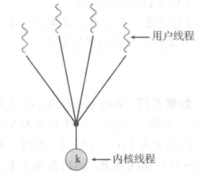
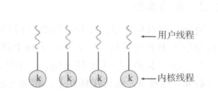
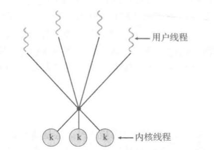
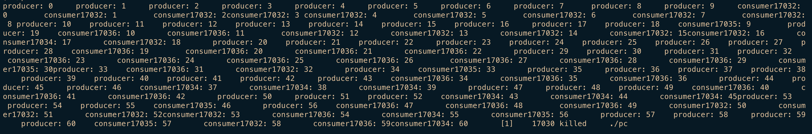
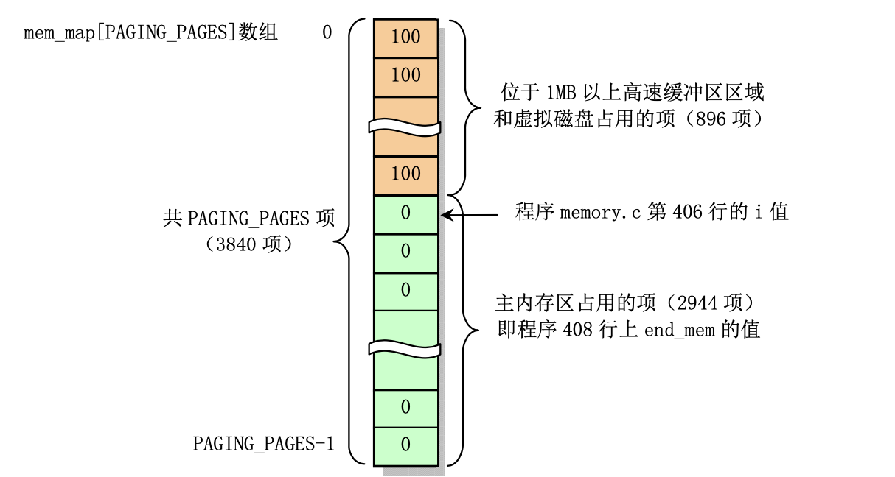

内核与进程模型总结
===

## 单CPU模式单任务单函数

### 1.（访存、IO及异常指令的运行过程）首先理解内存加载一个只有一个函数的程序，当然也有代码段和数据段。这里请根据8086CPU解释：

#### a) 通用寄存器有哪些？段的概念和CS、DS、SS的作用如何？CPU是如何从内存取到指令的？CS、IP（汇编语言书第二章）

- 通用寄存器包括ax bx cx dx

- 段的概念: 段的划分来自于CPU, 由于8086用"基础地址(段地址*16)+偏移地址=物理地址"的方式给出内存单元的物理地址,使得我们可以用分段的方式来管理内存.

- CS是代码段寄存器, DS是数据段寄存器, SS是栈段寄存器

- 在任意时刻,设CS寄存器中的内容是M, IP中的内容是N, 那么8086CPU将从内存M*16+N单元开始, 读取一条指令执行

#### b) 假设a)取到的是MOV指令，如何在寄存器到寄存器，寄存器到内存，内存到寄存器之间“复制”数据。能否实现内存到内存的“复制“数据？（汇编语言书第三章）

- 从寄存器到内存或者从内存到寄存器复制数据, 都要首先计算出在内存中存取数据的实际物理地址, 然后通过地址总线传输数据

- 不能实现从内存到内存直接复制数据, 要通过通用寄存器中转

#### c) 程序地址、段和链接的概念。（汇编语言书第四章）

- 程序地址: 程序段的地址

- 段: 见a)

- 链接:
    - 当源程序很大时, 可以将它分为多个源程序文件来编译, 每个源程序编译成目标文件后, 再用链接程序将它们连接到一起,生成一个可执行文件.
    - 程序中调用了某个库文件中的子程序, 需要将这个库文件和该程序生成的目标文件链接到一起, 生成一个可执行文件
    - 一个源程序编译后, 得到了存有机器码的目标文件, 目标文件中的有些内容还不能直接用来生成可执行文件, 链接程序将这些内容处理为最终的可执行信息.

#### d) 假设a)取到的是IN、OUT指令，请解释能实现哪些功能？包括端口和控制器的概念。（汇编语言第12－15章）

- in指令表示将某个数据写入到某个地址的端口中. 而所谓的端口就是以下各种芯片中的寄存器:
    - 各种接口卡(比如,网卡\显卡)上的接口芯片, 它们控制接口卡进行工作
    - 主板上的接口芯片, CPU通过它们对部分外设进行访问
    - 其他芯片, 用来存储相关的系统信息, 或进行相关的输入输出处理

- out指令表示将某个地址的端口中的数据读到某个通用寄存器中去

#### e) 假设a)取到的是INT指令，请解释异常、中断的概念及其作用。（汇编语言第12－15章）

- 实际上,异常和中断的概念之间没有很本质或者很明显的划分,感觉其名称更像是为了标明CPU处理指令序列时发生的"中断"是从何处来的,将要执行怎样的操作来处理.比如在<深入理解计算机系统>一书中就将"中断"归类为"异常"的一种.

- 狭义上的异常又叫做内中断,一般时CPU在执行指令中引起的,比如:
    - 除法错误,比如,执行div指令产生的出发溢出
    - 单步执行
    - 执行into指令
    - 执行int指令

- 狭义上的中断又叫做外中断. 这种中断信息来自于CPU外部,当CPU外部只有需要处理的事情发生的时候,比如说,外设的输入达到,相关新品啊将向CPU发出相应的中断信息. CPU在执行当前指令后,可以检测到发送过来的中断信息, 引发中断过程, 处理外设的输入.

## 二、单CPU模式单任务多函数

> 理解函数与函数的作用过程及栈的作用。

### 2.（函数调函数的过程及栈变化）假设内存加载了一个有两个函数的程序，一个是主函数A，它会call另一个函数B，请解释调用和被调用函数间，是如何实现参数传递的？另外，栈里面还存储哪些内容呢？被调函数B运行完成后，是如何返回到函数A中的？（汇编语言书第9、10章）

#### a) call XXX  XXX是指什么？ call 和 jmp 的区别是什么？

- XXX是将要跳转的目的地址. 这个地址可能存储在立即数中\寄存器中\内存单元中

- jmp指令是无条件的直接跳转,即仅更改CS和IP的值; 而call指令包含jmp指令,执行call指令的时候,会首先根据是长跳转还是短跳转来将IP或CS和IP入栈,然后再执行jmp指令.

#### b) 栈及栈帧用哪几个寄存器表示？SS：SP   SS：BP（汇编语言书第10章）

- 一共需要3个寄存器 SS SP BP

- 其中,SS:SP指向栈帧的栈顶, SS:BP指向栈帧的基地址

#### c) 尝试描述调用过程中栈的过程。（汇编语言书第10章）

- 主函数A在执行call指令调用函数B之前,首先会把部分寄存器压栈,防止被B函数破坏,然后把B函数需要的参数依次压栈

- 执行call指令,把当前CS和IP寄存器的值压栈,然后设置CS和IP为将要跳转的目的地址

- 开始执行函数B,执行主要指令序列结束后,执行ret指令,将之前压入栈中的CS和IP从栈中弹出,即恢复执行函数B之前的CS和IP的值

- CPU的控制权回到主函数A,继续执行主函数A接下来的指令序列

### 3. （函数中产生异常处理的过程及栈变化）假设内存加载了一个有两个函数的程序，一个是主函数A，另一个是异常处理函数B，A会通过INT指令，激活异常处理函数B的执行，请解释主函数A和异常处理函数B间，能实现参数传递的吗？如何实现？另外，两个函数共用一个栈可以吗？为什么？（汇编语言书第12、13章）

- 当然能传递参数,主函数A可以选择把参数就放到通用寄存器上,也可以选择把参数压入栈中,供异常处理函数B来寻址使用.

- 这两个函数当然可以共用一个栈,因为这种情况下是执行完B再返回去执行A,执行完B后,栈中跟B相关的东西就没有意义了,所以可以被覆盖\修改等,所以可以共用一个栈.

### 4. （函数中产生硬件中断的处理过程栈变化）假设内存加载了一个有两个函数的程序，一个是主函数A，另一个是键盘中断函数B，请解释主函数A和中断处理函数B间，能实现参数传递的吗？如何实现？另外，两个函数共用一个栈可以吗？为什么？（汇编语言书第14、15章）

- 当然能传递参数,主函数A可以选择把参数就放到通用寄存器上,也可以选择把参数压入栈中,供中断处理函数B来寻址使用.

- 这两个函数当然可以共用一个栈,因为这种情况下是执行完B再返回去执行A,执行完B后,栈中跟B相关的东西就没有意义了,所以可以被覆盖\修改等,所以可以共用一个栈.

### 5. （键盘中断驱动下的两函数交替运行）假设内存加载了一个有三个函数的程序，分别是函数A、B，还有一个是键盘中断函数C，键盘按下A时，运行函数A，键盘按下B时，运行函数B。请描述如何实现这一功能？（假设键盘按得慢，每次运行A和B时不会被下一次按键打断）三个函数共用一个栈可以吗？为什么？需要至少需要几个栈？每个函数用一个栈可以吗？为什么？

- 编写好函数A B C,然后在需要的情况下相互调用就好. 在主函数运行时,如果键盘中有一个键被按下,那将中断现在正在执行的主函数,跳转执行键盘中断函数C,然后C根据按下键的值的不同,去调用不同的函数A或函数B.

- 这三个函数可以共用一个栈. 在函数嵌套调用过程中栈不断往上生长就行,执行完一个函数后通过iret指令就能返回到调用者的调用函数时的现场.

## 三、单CPU模式多（线程）任务

理解函数作为线程运行的过程，线程的创建、中止及切换。

### 6. （时钟中断驱动下的两函数交叉运行）假设内存加载了一个有三个函数的程序，分别是函数A、B（每个可至少运行100秒以上），还有一个是时钟中断处理函数C，硬件时钟每毫秒产生一次中断，中断处理函数C返回时，轮流切换函数A、B的运行。请描述，如何实现这一功能？三个函数共用一个栈可以吗？为什么？需要至少需要几个栈？每个函数用一个栈可以吗？为什么？

这三个函数不能共用一个栈.至少要两个栈.

如果共用一个栈的话,假设在A执行但还没有结束的时候,要切换到函数B执行.如果共用一个栈的话,函数B的栈帧就要接着在A函数的栈上向上生长.接着,如果在B函数还没有结束的时候,又切换回A函数执行,这时A函数的栈帧也要接着向上增长,这样就会破坏函数B的栈帧,导致再次切换回B的时候产生错误.所以至少要使用两个栈.

由于函数C是中断处理函数,所以在执行函数C的时候不会再次发生中断,因此不用考虑保留函数C的执行状态,函数C完全可以与A函数或B函数共用一个栈.

### 7. （两函数的运行切换）上面第6题中，C函数需要知道函数A、B的入口地址或上次停止的地址，它怎么知道呢？尝试描述一下，如何表示这些信息，并描述一下从函数A中发生中断，运行C，然后切换到B的运行过程。

在第6题中我们知道,每个AB函数都对应一个栈,因此每个函数都有自己的`ss:sp`,每个函数也都有自己的指令执行序列,因此每个函数都有自己的`cs:ip`.从函数A中发生中断，运行C，然后切换到B的运行过程应该是这样的:

- 函数A收到中断信号,将自己当前的cs\ip\通用寄存器\标志寄存器等都压入栈中,同时,将自己当前的栈指针ss和sp存入自己的TCB中保存起来.

- 接着,A函数会去查找中断向量表,找到函数C的cs和ip,然后执行函数C的代码

- 函数C会选择执行A还是执行B,如果执行B的话,函数C会找到B的TCB,从中取出B的ss和sp,把自己的ss和sp置换为B的ss和sp,完成栈的切换

- 接着,函数C执行iret指令返回,该指令会把当前栈(现在已经是B的栈了)中保存的cs\ip\通用寄存器\标志寄存器等恢复出来(这些寄存器的值都是当初B中断的时候压入栈中的),这样cs和ip就会指向B的代码,其他寄存器也恢复到了从B中切换出去的时候的样子.

### 8. （线程的概念）你觉得第6、7中的两个函数A、B能够轮流运行，它们是两个线程吗？为什么？尝试描述一下你所理解的线程的概念是什么。

- 它们是两个线程.因为它们可以被调度,符合线程的条件.

- 我理解的线程: 可以被CPU调度的最小单位,有自己独立的运行栈,但数据段\代码段等都可以和其他线程共享.

### 9. 有了线程的概念后，我们就有需要把D函数、E函数等也创建成线程。要把一个普通函数创建成线程，需要做哪些事情呢？TCB有哪些内容？尝试描述并实现一个create_thread?

- 要把一个普通函数创建为线程,要在内存中要分割出一块空间作为该线程的TCB,然后给该线程分配一个唯一的线程号,保存在系统的线程表中.

- 一个TCB中必须应该包括的内容:
    - 线程的运行状态,标明线程是运行\就绪\阻塞
    - 线程使用的运行时栈的栈指针

- 一个TCB中还可以包含的内容,如果是基于栈的线程切换的话,下面这些内容也可以直接压入线程的运行时栈中:
    - 线程的cs和ip寄存器
    - 线程的标志寄存器
    - 线程的通用寄存器(存放必要的参数等)

### 10. 如果想终止一个线程，需要做哪些事情呢？尝试描述并实现一个cancel_thread?

如果要终止一个线程,只需要把线程对应的TCB块的内存释放,然后从系统的线程表中删除该线程的线程号.

### 11. 如果我们有一个线程A（函数A）和线程B（函数B）的协作需求，必须在A执行过A函数的S1语句后，B才能执行B函数的S2语句，这就是同步。实现同步，实际上就是当运行到S2时检查一下S1运行过没有；如果运行过了，就继续，如果没有，就阻塞住线程B的运行。阻塞的方式有两种，一种是让它空转并所得查看S1，一种是让它睡眠等待S1执行过后的唤醒。临界区、锁、关中断、互斥量、信号量、条件变量等概念及其实现。

#### 临界区

进程要进行修改公共变量\更新一个表\写一个文件等操作的代码区.

#### 锁

锁是解决临界区问题的一种机制. 当一个进程进入临界区的时候, 会获得锁, 给临界区上锁, 这样其他进程就不能访问该临界区的公共变量了. 当进程退出临界区的时候会释放锁,  这时其他进程将可以修改临界区中的公共变量.

#### 关中断

- 如果CPU在执行某一段指令之前关闭中断,就表示该CPU在执行这段指令的过程中不会响应中断,这几个指令就相当于是原子操作.

- 可以使用在进入临界区之前关中断的方法来使对变量的修改变成原子操作,从而达到互斥的目的.

#### 互斥量

- 互斥量其实就是互斥锁.它用于实现关于只有一个实例的共享资源的同步和互斥.

- 锁是解决临界区问题的一种机制. 当一个进程进入临界区的时候, 会获得锁, 给临界区上锁, 这样其他进程就不能访问该临界区的公共变量了. 当进程退出临界区的时候会释放锁,  这时其他进程将可以修改临界区中的公共变量.

#### 信号量

信号量可以分为二值信号量和计数信号量. 其中二值信号量与互斥锁的作用基本相同. 而计数信号量可以表达更多的信息, 它可以用于控制访问具有多个实例的资源. 信号量的初值一般是可用资源数量, 而某一刻信号量的值则表示还有多少个实例可以被其余进程占用. 如果信号量为负值, 则可以表示有多少个进程再等待使用该资源.

#### 条件变量

我的理解是,条件变量可以看做是信号量的一种延伸, 它与信号量不同的是, 条件变量一般用于线程之间,信号量一般用于进程之间.它可以有这样一个数据结构:一个变量和一个等待队列. 变量的大小和范围表示某种条件,不满足该条件的进程将会被加入到等待队列,满足该条件时队列中的进程会被唤醒,变成就绪态.

> 目前为止，每个线程都可以调用create_thread创建线程，每个线程都可以直接IO操作，都可以设置时钟中断的时长，如果它恶意的修改了中断处理函数用来决定切换顺序的数据结构，那么就会影响整个系统的运行。程序空间就是物理空间。

> 把开关中断，IO指令、时钟周期的设置等等涉及到整个计算机系统运行情况的CPU指令作为特权指令，只让服务于整个系统的函数才能使用，其他普通线程函数都只能使用这些指令以外的普通指令。

> 这样把CPU设计开两种运行模式（系统模式和用户模式）。系统模式下能够运行CPU所有指令，用户模式下，只能够运行CPU普通指令。

> 在CPU双模式下，把创建线程、中止线程，创建信号量、PV操作、开关中断，IO指令、I异常和中断处理函数等涉及到多个线程和整个系统相关的函数，与普通线程的函数区别开来（作为OS的雏形）

> 作为OS雏形的部分（包括C函数），放置在内核空间，作为多线程的A、B函数，放置在用户空间。

## 双CPU模式单进程空间

> 理解进程空间由用户空间和内核空间组成。理解基于386如何搭建出一个进程空间。用户程序对过分段到线性空间的用户空间部分，内核程序通过分段映射到线性空间的内核空间部分。线性空间就是物理空间。

### 12. 在386启动过程中，将CR0寄存器的保护模式位置位，也就是启用保护模式，使386CPU具备了0-3四个运行级别。操作系统里说的CPU双模式，指的是386里的0和3两个运行级别。0级别是系统模式，3级别是用户模式。请说说386设置4个运行级别的目的是什么？为什么操作系统只用了两个运行级别（双模式）？

- 386设置4个运行级别的目的是为了防止运行在较低特权级上的程序或任务访问具有较高特权级的段.

- 操作系统只是用了两个运行级别的原因: 为了与只提供了两个特权级的处理器兼容.

### 13. 分段的作用，是通过段表，把一个程序中的多个段映射到一维的线性空间（4GB）。为便于理解，本部分下面的几个问题都假设计算机正好也有4GB的物理内存，这样4GB的线性空间正好能一对一装载到物理空间。

### 14. CS：EIP是386CPU给出的PC（程序地址），DS：EXX是数据地址，SS：ESP是栈地址，SS：EBP是栈帧地址。试描述一下CS、DS、SS和GDTR、LDTR的关系。GDT、LDT里面存储的都是段描述符，有什么区别吗？

#### CS、DS、SS和GDTR、LDTR的关系

- GDTR和LDTR都是中分别存放着GDT表和LDT表的基地址和表长度

- CS\DS\SS都是段寄存器,分为两部分,可见部分和不可见部分
    - 可见部分存放着段选择符,该段选择符是其所指向的段描述符在GDT表或LDT表中的偏移位置,也就是说,GDTR或LDTR中的表基地址加上段选择符,就可以获取到段描述符,而从段描述符中就可以找到段的基地址.
    - 不可见部分一般存放着段描述符的一些基本信息.这样程序在执行的时候就不用每次都去查找LDT表了,可以节约时间提高效率.

### 15. 现在假设一个执行文件里保存了内核的代码段和数据段，一个执行文件里保存了用户空间的代码段和数据段。我们直接把这四个段装载到物理内存，可能会存在什么问题？

如果没有附加段机制或者分页机制这些保护措施的话,可能会导致用户程序修改内核的代码或者数据,从而引发错误.

### 16. 还是假设第15 题中的两个可执行文件，我们想把内核的段映射到内核空间（CPL、DPL为0），把用户的段映射到用户空间（CPL、DPL为3），直接在GDT里创建四段描述符，可以吗？在GDT里创建内核两个段的描述符，再创建一个LDT的描述符；然后在LDT里再创建两个用户段的描述符，也是一种方案。这两种方案各有什么优缺点？

- 这两种方案都是可行的

- 直接在GDT表中创建内核的两个段的描述符
    - 可以简化从逻辑地址到线性地址的地址转化操作,应用程序只需要一个GDTR寄存器即可.
    - 减少内存空间的开销

- 在GDT里创建内核两个段的描述符，再创建一个LDT的描述符；然后在LDT里再创建两个用户段的描述符
    - 方便实现多个用户任务对线性空间的隔离和映射,每个用户任务只能使用自己的LDTR来访问自己的LDT表,无法访问其他用户任务的LDT表
    - 当然,本题中讨论的是只有一个内核段和一个用户段,所以实际上不存在多个用户任务互相访问对方的LDT表的情况

### 17. 当然，为了让内核空间的程序和用户空间的程序能够运行，我们需要分别在内核空间和用户空间各创建一个栈段，也就是要在GDT、LDT增加两个段描述符。试基于16题里的两种方案分别讲讲在哪里增加。

- 直接在GDT表中创建内核的两个段的描述符
    - 不管是用户空间还是内核空间,都直接是直接在GDT表中增加一个段描述符,不过要注意内核的段和用户的段描述符要设置不同的DPL

- 在GDT里创建内核两个段的描述符，再创建一个LDT的描述符；然后在LDT里再创建两个用户段的描述符
    - 要在内核空间创建一个栈段的话,只需要在GDT表中增加一个段描述符
    - 要在用户空间创建一个栈段的话,需要在该用户任务对应的LDT表中增加一个段描述符
 
> 有了386的0，3运行级别，以及GDT和LDT的初始化后。下面我们再回头看看第二部分和第三部分的各题目的故事，有了哪些变化。


## 五、双CPU模式单进程空间单线程

> 理解一个进程程序运行过程中，用户空间和内核空间两个空间的来回切换。

### 18. 第二部分第2题（简写为“二2”题，以下所有题号简写类似），有了两个可能，①在用户空间的函数调用函数，用用户空间的栈。②在内核空间的函数调用函数，用内核空间的栈。

### 19. 第二3题，在用户空间执行INT 0x80指令时，会引发CPU运行级别3到用户级别0的切换。同时也会发生栈的切换。CPU具体做了哪些事情，请参考386手册，在系统启动时有对IDT的初始化，那个地址指向的就是系统调用的总入口函数。这也是系统调用的实现原理。请简述系统调用的概念及在386上的实现方法。

#### 用户空间执行INT 0x80指令,发生栈的切换时,CPU具体做了哪些事情

- 根据中断号`0x80`,从IDT中找到中断门描述符

- 特权级检查,检查门描述符的DPL是不是大于等于当前任务的CPL,由于`0x80`中断的门描述符的DPL和用户任务的CPL都是3,所以这里的检查会通过.

- CPU从当前任务的TSS段中得到该任务对应的内核栈的段选择符和栈指针

- CPU临时保存当前使用的栈选择符和栈指针,然后切换ss和sp寄存器,使切换到内核栈中,然后在内核栈中压入刚才临时保存的栈选择符和栈指针

- CPU把EFLAGS\CS和EIP寄存器的当前值压入内核栈中

- CPU设置CS:IP为处理函数的入口,开始执行中断处理函数

#### 系统调用的概念及在386上的实现方法

- 系统调用就是指用户任务调用操作系统内核管理中的函数,以实现一些必须依赖内核来完成的功能.

- 实现方法:
    - 用户任务执行`int 0x80`指令,并根据具体的系统调用函数的不同把不同的系统调用号赋值给%eax,这个系统调用号就表示要执行具体哪个系统调用函数;至于函数调用具体的参数,可以选择直接赋值给寄存器传递,也可以压入新的栈中传递
    - 接着,发生栈切换,具体过上上面已经提到
    - CPU运行执行`system_call.s`程序,根据不同的系统调用号执行相应的处理函数
    - 处理函数把返回值放入eax寄存器中,使用`ret`指令返回到`system_call.s`
    - 在`system_call.s`中,使用`iret`指令把栈再切换回去,返回用户空间的栈
    - CPU继续执行用户空间的代码,从eax寄存器中读取返回值

### 20. 第二4题，用户空间的函数A在运行过程中，发生了硬件中断，描述中断发生后，运行级别及栈的切换过程。请参考386手册。

- 运行级别,也就是CPL会从3改为0

- 接着,不会进行特权级检查

- 接下来的执行过程与上一题中的相同

### 21. 二5题，可以把函数A、B理解成位于用户空间，通过内核空间的中断处理函数，来帮助切换用户空间两个函数的交替运行。为第三6题理解纯用户线程做准备。

### 22. 当然，第二5题，也可以把函数A、B理解成位于内核空间，也就是他们是OS的函数。来理解纯内核线程的概念。

## 六、双CPU模式单进程空间多线程

> 理解纯用户线程（参考线程库对线程的管理），纯内核线程（参考linux0号进程），线程模型
 
### 23. 根据三6——三7题，假设函数A、B位于内核空间，也就是要把函数A、B创建成两个纯内核线程，尝试描述它们的TCB及时钟中断驱动下的任务切换过程。(参考Linux0号进程)

#### TCB中应该包含的内容

- 线程被中断时的栈指针: ss\esp

- 线程的执行状态: 就绪\运行\阻塞 等等

#### 任务切换过程


- 线程A收到时钟中断信号,把自己当前的标志寄存器\cs\eip等压入当前的栈中

- 然后通过查询中断向量表,设置cs和ip,去执行调度函数的代码,注意,这时ss和sp这些栈指针还没有变化,也就是说现在还是在A的栈中

- 调度函数决定下一步去调用B线程,于是找到B的TCB,先把当前的栈指针(也就是A当前的栈指针)保存到A的TCB中,再从B的TCB中读取B的栈指针,从而修改当前的ss和sp寄存器,从而完成到B的栈的切换

- 注意,此时cs和ip都还没有变化,于是,CPU会接着执行调度函数的最后一条指令:`iret`.这条指令会导致从当前栈(B的栈)中恢复标志寄存器\CS\EIP,这样就相当于恢复了B当初被中断时候的样子

- 同样地,我们看到,经过上一步的`iret`指令,cs和ip也被修改了,CPU将接着执行B的代码

### 24. 根据三8——三10题，要把内核空间的函数A、B创建成纯内核线程，需要设计的TCB应包括哪些内容？创建和中止纯内核线程的函数如何实现？

#### TCB中应该包含的内容

- 线程被中断时的栈指针: ss\esp

- 线程的执行状态: 就绪\运行\阻塞 等等

#### 创建纯内核线程的函数

- 在内存中开辟一块区域,作为新的线程的运行时栈和存放该线程的TCB

- 开辟这块空白的内存区域后会返回一个指针,该指针就可以作为该线程的TCB的指针,我们可以规定每个线程都有固定的TCB的大小,所以可以在获取的TCB的指针的基础上加上固定的偏移,很容易地算出线程的运行时栈的位置

- 我们把上一节获得的TCB指针插入到系统的线程表中,其对应的编号就是该线程的线程号

- 接着,初始化TCB中的栈指针,设置TCB中记录的线程的状态为就绪态

- 最后,初始化新的线程的运行时栈,把它制作成一个线程终止时的样子,以便于第一次调用它的时候,使用`iret`指令能正确恢复cs\ip\标志寄存器等寄存器的样子

#### 中止纯内核线程的函数

线程被中断或者自己使自己睡眠的时候自然就被中止了

#### 终止纯内核线程的函数

- 释放TCB指针指向的包含TCB块和线程运行时栈的那一段内存

- 从系统的线程表中删除该线程对应的那一项

### 25. 题23、24把函数A、B假设位于用户空间，也就是要把函数A、B创建成两个纯用户线程，尝试设计TCB及相应的创建、中止及调度函数。

- 纯用户线程相比于纯内核线程又这么几个不同之处:

    - 若干几个纯用户线程是由一个纯内核线程或内核线程创建的,内核看不到具体纯用户线程的TCB等,也就无法实现调度

    - 因此,纯用户线程通过中断\系统调用等进入内核态实际上是通过创建其自身的内核线程做到的

- 因此,要想实现纯用户线程的调度,就需要在纯用户线程中断的时候把线程用到所有的寄存器等信息都存储到自己的TCB中,而不能压入栈中.

- 因为,即使压入栈中,压入的也是该纯用户线程对应的内核线程的在内核中的栈,而还有可能其他的纯用户线程也会向该内核线程的内核栈中压入数据,这样返回的时候就会产生错误.

- 所以,对于纯用户线程的创建\终止等的设计,要考虑把更多的信息(通用寄存器\标志寄存器等)都放到TCB中,其他的应该和纯内核线程相同.

### 26. 在题25中，纯用户线程的TCB位于用户空间，使用用户空间的栈运行，假设A用户线程运行过程中，调用read系统调用，调用过程中因为磁盘忙而阻塞。而后到了B用户线程，而B线程运行过程中，需要调用write系统调用。请问这时的B线程能做write系统调用吗？为什么？

- 如果线程A和线程B是同一个内核线程创建的,那么B线程此时不能进行write的系统调用

- 因为线程A进行系统调用的时候,会进入到内核态,也就相当于切换到了创建它的那个内核线程中去执行.read系统调用阻塞,也就是说该内核线程阻塞.

- 那么B要进行系统调用的话也要切换到该内核线程,但该内核线程已经阻塞了,所以B将不能进行系统调用.

### 27. 怎么样才能解决题26中B线程不能再做系统调用的问题呢？尝试描述各种不同线程模型的解决方案间的异同。（从内核栈的角度考虑，多个系统调用能否使用一个栈）

#### 怎样才能解决26题中的问题呢?

- 核心观点就是不能让线程B和线程A共用同一个内核栈

- 可以把线程A和线程B都设计成内核线程,都有自己的一套内核栈和用户栈.这样线程A在内核中阻塞的时候,内核依旧可以调度线程B.

#### 不同的线程模型

- 多对一模型

    - 

    - 该模型映射多个用户级线程到一个内核线程，效率最高。但如果一个线程执行阻塞系统调用，那么整个进程都将会阻塞。

- 一对一模型

    - 

    - 该模型对每个用户级线程都会映射到一个内核线程。Linux和Windows都实现了这种一对一模型。

- 多对多模型

    - 

    - 该模型多路复用多个用户级线程到同样数量或更少数量的内核线程。

### 28. 对比Linux和Windows的线程模型。

- Linux内核中准确来讲没有线程的概念,Linux的线程其实是一些与其他进程共享内存等资源的进程

- Windows内核中天然支持线程的概念.每个进程都会创建一个主线程,这个主线程在运行过程中又会创建其他的线程.内核通过调度线程来分配CPU时间等资源.
 
> 第四、五部分的题目，假设线性空间就是物理空间，导致一个计算机的物理内存，只能放一个线性空间（进程）。如何能在一个计算机的物理内存中，放入多个程序（进程）的线程空间呢？把线性空间分页，通过页表映射到物理内存，是一种解决方案。

> 说明：Linux0.11是把多程序（进程）的空间映射到了一个线程空间，但现代OS一般把一个程序（进程）和内核合在一起单独映射成一个线性空间。

## 七、双CPU模式多进程空间

> 理解进程的表示及进程的创建、切换与中止。

### 29. 如何把OS，多个用户程序，映射到一个物理空间，还做到相互隔离呢？一种办法是，参考题16的第一种方法，只用GDT，把内核和多个程序，都映射到一个线性空间，这样的好处和缺点分别是什么？

- 好处
    - 实现简单
    - 只需要一张GDT表,不再需要额外的LDT表,节省了内存开销

- 缺点
    - GDT表的大小是有限的,如果所有的用户程序和内核的数据段\代码段\运行的栈段的段描述符都放到一张GDT表,会严重限制系统能同时运行的任务的数量
    - 同意运行级别(段描述符的DPL相同)的用户任务之间可以互相访问内存,很可能会导致错误.

### 30. 一种办法是，参考题16的第二种办法，用GDT映射内核，并存放LDT的描述符，但所有内核和程序都映射一个线性空间，线性空间直接映射到物理空间。这里没有使用分页。比较这样做，跟题六29的优缺点对比。

- 优点
    - 对不同任务之间的线性空间进行了比较好的隔离,使不同的用户任务之间不能相互干扰内存

- 缺点
    - 实现起来比较复杂,需要额外的许多LDT表,增大的内存开销

### 31. 题六30的方案，也可把线性空间分页，通过两级页表映射到物理内存。这样做的好处是，物理内存就可按页为单位管理，比按段为单位管理方便有效多了。为什么？0.11采用的是这种方案。

- 分段的长度是不确定的,而分页的长度是固定的4k.由于应用程序使用段的大小的不确定性,段与段之间很难做到严格对齐,这就会导致产生很多内存碎片

- 如果仅使用了分段地址转换,那么存储在物理内存中的一个数据结构将包含其所有的部分.但如果使用了分页,那么一个数据结构就可以一部分存储在物理内存中,而另一部分保存在磁盘中.

### 32. 现代OS一般把一个程序（进程）和内核合在一起单独映射成一个线性空间。再把线性空间分页，再通过页表映射到物理内存。这样一是进程有了更大的独立空间，二是题六31的物理内存管理的优点也占上了。当然也有缺点，就是切换进程是要切换页目录的，所有cache可能失效。

### 33. 基于题六32，把程序空间和内核空间映射到一个线性空间，如果提前规定好内核和用户程序使用哪部分的线性空间，这样就可在链接的时候，由链接器直接生成线性地址，也就是在链接时，就把内核和用户程序的各个段都映射到线性空间（进程空间）了。这一点等同于Intel386的平台地址思想。实际上在运行前，进程的分段映射就已经完成了，实际运行时，只需要分页就可以了。

### 34. 基于题六33，因为386必须分段，所以可考虑利用其线性地址，基于分页实现多个线性空间到一个物理空间的映射。

### 35. 当系统内在多个程序和内核存在时，如何区分并表示运行中的程序，即进程呢？也就是PCB中应该有哪些数据项呢？参考现代操作系统的图示、Linux的task_struct、0.11的task_struct+TSS（为什么要考虑TSS？）。

#### 如何区分并表示运行中的程序，即进程呢？

给每个进程创建一个进程控制块(PCB),然后给每个PCB分配一个编号,用来唯一标识一个进程

#### PCB中应该有哪些数据项

- 基本信息: 进程号\进程组\进程运行状态\寄存器快照等

- 文件信息: 打开的文件描述符\工作目录等

- 内存信息: 页目录的基地址(CR3) LDT段选择符  不同特权级的堆栈指针 等等

### 36. 参考Linux2.6以上的task_struct, （进程那章课件里有），解释什么是轻量级进程，为什么叫轻量级呢？线程是不是轻量级进程，为什么？

#### 什么是轻量级进程

轻量级进程是一种进程,这种进程和其他进程共享所有（或大部分）它的逻辑地址空间和系统资源.

#### 为什么叫轻量级?

因为轻量级进程只有一个最小的执行上下文和调度程序所需的统计信息

#### 线程是不是轻量级进程

- 线程不是轻量级进程

- LWP有它自己的进程标识符，并和其他进程有着父子关系,这些都是线程没有的

- 线程既可由应用程序管理，又可由内核管理，而LWP只能由内核管理并像普通进程一样被调度。

### 37. 在三6、三7题的基础上，结合题六32、六36，对比进程切换和线程切换的联系与区别。

- 联系
    - 当CPU从属于进程A的线程切换到一个属于进程B的线程的时候,就会发生进程的切换

- 区别
    - 进程的切换要保存和恢复大量的上下文信息,会比较耗时.
    - 而如果切换的两个线程共享了内存\文件描述符等信息,那么切换时所保存的上下文就会少很多,就能做到比较快的切换.

## 八、进程间通信与同步

> 在进程空间相互独立后，进程间相互的协作可分为三类：1是传递数据，2是同步，3是互斥访问共享数据。

### 38. 能够用在进程间通信和同步的工具包括：共享内存、消息队列、信号量。另外，管道也、socket、普通文件也是进程间进行数据传递的方式。能够用在进程之间通信和同步的工具，是需要在内核实现的。

### 39. 信号是内核与用户程序之间，不同进程用户程序之间沟通的一种异步机制。通常其实现方式直接包含在进程概念中，因此是UNIX操作系统一种基础机制。

### 40. 联系题三11，生产者——消费者问题，读者——写者问题、哲学家就餐问题，应该能通过选用以上合适的同步工具，以多进程或多线程的方式实现相应的应用程序。

在这里,我使用信号量和互斥锁实现了生产者--消费者问题.

- 共使用了三个文件: `tmp`  `in`  `out`. 

- `tmp`文件用于存放10个整数,作为生产者和消费者存取数字的缓冲区.  

- 文件`in`用于存放生产者进程现在该生成那个数字了,生产者在生成数字前,先打开`in`文件,读出应该生成哪个数字,然后把要生成的这个数字按照顺序写到文件`tmp`的相应位置.接着,把从`in`中读到的数字加一,表示这是下一次要生产的数字,然后把这个数字写回到文件`in`中.

- 文件`out`用于存放消费者现在已经消费了多少个数字,具体的使用方法和生产者对`in`文件的使用相同,这里不再赘述.

具体的代码如下:

```c
#include <fcntl.h>
#include <semaphore.h>
#include <stdio.h>
#include <sys/stat.h>
#include <sys/types.h>
#include <sys/wait.h>
#include <unistd.h>

// 定义缓冲区大小为10
#define BUFF_SIZE 10

// 定义生产的最大数字是60
#define MAX_NUMBER 60

// 开启的子进程,也就是消费者进程的个数
#define N_CHILD 5

// 整个过程中要用到的信号量
sem_t *empty;
sem_t *full;
sem_t *metux;

void producer() {
    while (1) {
        sem_wait(empty);
        sem_wait(metux);

        // 打开文件,将要执行写操作
        int file = open("tmp", O_WRONLY);
        // 读出这次应该写的序号是多少
        int in;
        int in_file = open("in", O_RDWR);
        read(in_file, (void *)&in, sizeof(int));
        // 算出这次写操作的偏移,也就是要到哪里去写
        lseek(file, (in % BUFF_SIZE) * sizeof(int), SEEK_SET);
        // 写入数据
        write(file, (void *)&in, sizeof(in));
        printf("producer: %d\t", in);
        fflush(stdout);

        in++;
        lseek(in_file, 0, 0);
        write(in_file, (void *)&in, sizeof(int));

        close(file);
        close(in_file);

        sem_post(full);
        sem_post(metux);

        if (in > MAX_NUMBER) {
            break;
        }
    }
}

void consumer() {
    while (1) {
        sem_wait(full);
        sem_wait(metux);

        // 打开文件,将要执行读操作
        int file = open("tmp", O_RDONLY);
        int out_file = open("out", O_RDWR);
        int out;
        read(out_file, (void *)&out, sizeof(out));
        // 算出这次读操作的偏移,也就是去哪里读
        lseek(file, (out % BUFF_SIZE) * sizeof(int), SEEK_SET);
        // 读入数据
        int out_number;
        read(file, (void *)&out_number, sizeof(out_number));
        printf("consumer%d: %d\t", getpid(), out_number);
        fflush(stdout);
        out++;
        lseek(out_file, 0, 0);
        write(out_file, (void *)&out, sizeof(int));
        close(out_file);
        close(file);

        sem_post(empty);
        sem_post(metux);

        // 如果读到了最大值, 就退出
        if (out_number >= MAX_NUMBER) {
            return 0;
        }
    }
    return 0;
}
int main(int argc, char const *argv[]) {
    metux = sem_open("metux", O_CREAT | O_TRUNC, 0666, 1);
    full = sem_open("full", O_CREAT | O_TRUNC, 0666, 0);
    empty = sem_open("empty", O_CREAT | O_TRUNC, 0666, BUFF_SIZE);

    // 消费者和生产者共用的用于交换数据的文件
    int file = open("tmp", O_RDWR | O_CREAT, S_IRWXU);
    close(file);

    // 该文件用于生产者存放现在生产到哪个序号了
    int in_file = open("in", O_RDWR | O_CREAT, S_IRWXU);
    int tmp = 0;
    lseek(in_file, 0, 0);
    write(in_file, (void *)&tmp, sizeof(tmp));
    close(in_file);

    // 该文件用于消费者存放现在读到第几个数字了
    int out_file = open("out", O_RDWR | O_CREAT, S_IRWXU);
    write(out_file, (void *)&tmp, sizeof(int));
    close(out_file);

    if (!fork()) {
        for (int i = 0; i < N_CHILD; i++) {
            if (!fork()) {
                consumer();
            }
        }
    } else {
        producer();

        sleep(1);
        sem_unlink(metux);
        sem_unlink(full);
        sem_unlink(empty);
        // 杀掉正在等待的所有父进程和子进程
        kill(0, 9);
    }
    return 0;
}
```

运行效果如下图所示:



### 41. 对锁、信号量、管程，应该尽量掌握其实现方式。

### 42. 对信号和管道，可尝试理解其实现方式。管道以文件形式实现，在学习文件系统后，可尝试理解。

## 九、调度和死锁

> 针对不同适用领域的OS，会有不同的调度设计指标。调度不好，会死锁。要预防和避免。

### 43. 抢占式、非抢占式调度的概念。

抢占式调度和非抢占式调度都是在根据进程的优先级来调度,在调度发生时,优先级高的进程总是有限被执行.两者的不同之处在于调度发生的时机不同.

CPU调度决定可能发生在以下四种情况下：

1. 当某个进程从执行状态切换到等待状态 （例如，由于I/O请求）；

2. 当某个进程从执行状态切换到就绪状态 （例如，发生中断）；

3. 当某个进程从等待状态切换到就绪状态 （例如，I/O完成）；

4. 当某个进程终止。 

- 如果仅在1或4情况下发生的调度,是非抢占式调度

- 在2或3情况下发生的调度,是抢占式调度

### 44. 调度算法的评估标准有哪些？

- 面向用户的评价标准
    - 周转时间短. 从任务开始被执行到任务执行结束所经过的时间.
    - 响应时间快. 从用户提交任务(比如按下键盘上的某个键)到系统开始执行这个任务间隔的时间越短越好.
    - 优先权准则. 用户指明提交的紧急任务,系统要能优先执行.

- 面向系统的评价标准
    - 系统吞吐量. 操作系统单位时间内完成的任务数量.
    - CPU的利用效率.
    - 各类资源的平衡利用.

### 45. Linux、Window实际使用的一些调度算法。

#### Linux

- 完全公平调度(CFS)

- 实时调度

#### Windows

- Windows采用基于优先级的,抢占调度算法来调度线程.Windows调度程序确保具有最高优先级的线程总是在运行的.

- 由调度程序选择运行的线程会一直运行,知道被更高优先级的线程所抢占,或终止,或时间片一到,或调用阻塞系统调用(如I/O).

- 如果低优先级线程运行时,更高优先级的实时线程编程就绪,那么低优先级线程就被抢占.

### 46. 死锁的概念，死锁发生的四个充要条件。死锁的预防、避免、检测与恢复方法。

#### 死锁的概念

在多道程序环境中,多个进程可以竞争有限数量的戏院.当一个进程申请资源时,如果这是没有可用资源,那么这个进程进入等待状态.有时,如果所申请的资源被其他等待进程占优,那么该等待进程有可能再也不发改变状态.这种情况称为死锁.

#### 死锁的四个充要条件

- 互斥. 至少有一个资源必须处于非共享模式,即一次只有一个进程可使用.如果另一进程申请该资源,那么申请进程应等到该资源释放为止.

- 占有等待. 一个进程占有至少一个资源,并等待另一个资源,而该资源为其他进程所占有.

- 非抢占. 资源不能被抢占,即资源只能被进程在完成任务后自愿释放.

- 循环等待. 有一组等待进程{p1,p2,p3,...,pn}, p0等待的资源为p1占有,p1等待的资源为p2占有,...,p(n-1)等待的资源为pn占有,pn等待的资源为p0占有.

#### 死锁的预防和避免

破坏死锁出现的4个充要条件之中的任何一个都可以避免产生死锁.

#### 死锁的恢复方法

- 终止一个或多个进程以打破循环等待

- 从一个或多个死锁进程那里抢占一个或多个资源

## 十、内存管理

> 理解现代OS进程空间按需分配、物理内存按供分配、关键数据结构建立缓存池的指导思想。

### 47. 理解程序运行的局部性原理。

局部性原理分两部分.

- 时间局部性: 如果某数据被访问，则不久之后该数据可能再次被访问。

- 空间局部性: 一旦程序访问了某个存储单元，则不久之后。其附近的存储单元也将被访问。

### 48. 完整地理解虚拟存储的概念，即利用外存做内存。可执行文件的格式（如ELF）。

- 虚拟存储是指计算机呈现出要比实际拥有的内存大的多的内存量.因此它允许程序员编制并运行比实际系统拥有的内存大得多的程序.这使得许多大型项目也能在具有有限内存资源的系统上实现.

- 虚拟存储可以使主存储器成为外存的一个高速缓存.

### 49. 请求调页与缺页中断的概念、实现方法与运行过程。交换空间的概念、页替换算法，以及交换过程。工作集和系统颠簸的概念，系统互锁的概念。

#### 请求调页与缺页中断的概念、实现方法与运行过程

- 当CPU引用一个地址时,如果该地址对应的数据块在内存中不存在,就会产生一个异常,当前运行的任务被缺页中断.

- 接着,当前运行的任务向操作系统请求调页,即把所缺失的页面从外存中取出,加载到内存中去.

- 缺失的页面加载完成后,会向CPU发送信号,此时之前被缺页中断的任务可能被重新调度执行.

#### 交换空间的概念、页替换算法，以及交换过程

- 在虚拟存储的机制下,操作系统可以将物理内存中短期内不会被访问到的数据写到外存中,以拓展物理内存有限的空间.外存中的被写入的这部分空间就叫做交换空间.

- 页替换算法
    - 先进先出算法(FIFO)
    - 最近最少使用算法(LRU)
    - 最少使用算法(LFU)

#### 工作集和系统颠簸的概念

- 局部性原则保证了,在任意时刻,程序将往往在一个较小的活动页面集合上工作,这个集合叫做工作集.

- 物理内存中页面不断换进换出的状态叫做系统颠簸.

### 50. 解释物理内存页的管理（分配和回收）方式。

- 内核使用了一个字节数组`mem_map[]`来表示物理内存页面(物理内存中1MB以上的区域)的状态.每个字节描述一个物理内存页的占用状态.其中的值表示被占用的次数,0对应的物理内存空闲着.当申请一页物理内存时,就将对应的字节的值增1.

- 在内存管理初始化过程中, 系统首先算出1MB以上内存区域对应的内存页面数(PAGEING_PAGES),并把`mem_map[]`所有项搜置为100(占用),然后把主内存区域对应的`mem_map[]`项中的值清零.



#### 分配内存

`get_free_page()`函数用于在主内存区中申请一页空闲内存页，并返回物理内存页的起始地址。它首先扫描内存页面字节图数组`mem_map[]`，寻找值是0的字节项（对应空闲页面）。若无则返回0结束，表示物理内存已使用完。若找到值为0的字节，则将其置1，并换算出对应空闲页面的起始地址。然后对该内存页面作清零操作。最后返回该空闲页面的物理内存起始地址。

#### 回收内存

`free_page()`用于释放指定地址处的一页物理内存。它首先判断指定的内存地址是否<1M，若是则返回，因为1M以内是内核专用的;若指定的物理内存地址大于或等于实际内存最高端地址，则显示出错信息；然后由指定的内存地址换算出页面号：(addr-1M)/4K；接着判断页面号对应的`mem_map[]`字节项是否为0，若不为0，则减1返回；否则对该字节项清零，并显示“试图释放一空闲页面”的出错信息。